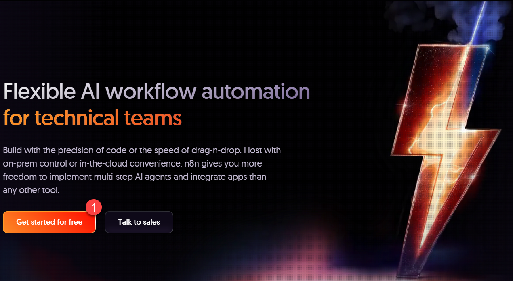
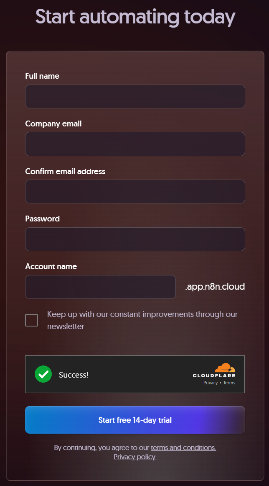

# n8n Cloud 免費試用申請教學 / n8n Cloud Free Trial Guide

> 本文件提供繁體中文與英文對照教學，協助您從零開始申請並管理 n8n Cloud 免費試用帳號。

## 目錄 / Table of Contents

- [n8n Cloud 免費試用申請教學 / n8n Cloud Free Trial Guide](#n8n-cloud-免費試用申請教學--n8n-cloud-free-trial-guide)
  - [目錄 / Table of Contents](#目錄--table-of-contents)
  - [簡介 / Introduction](#簡介--introduction)
  - [申請流程 / Signup Steps](#申請流程--signup-steps)
  - [驗證與啟用 / Verification \& Activation](#驗證與啟用--verification--activation)
  - [試用限制 / Trial Limits](#試用限制--trial-limits)
  - [管理與維運 / Administration \& Maintenance](#管理與維運--administration--maintenance)
  - [常見問題 / FAQ \& Troubleshooting](#常見問題--faq--troubleshooting)
    - [試用要怎麼取消？ / How do I cancel the trial?](#試用要怎麼取消--how-do-i-cancel-the-trial)
    - [超過 14 天或 1,000 次執行怎麼辦？ / What if I need more than 14 days or 1,000 executions?](#超過-14-天或-1000-次執行怎麼辦--what-if-i-need-more-than-14-days-or-1000-executions)
    - [無法登入 Admin Dashboard？ / Can’t reach the Admin Dashboard?](#無法登入-admin-dashboard--cant-reach-the-admin-dashboard)
    - [試用到期後還能取回資料嗎？ / Can I recover workflows after expiration?](#試用到期後還能取回資料嗎--can-i-recover-workflows-after-expiration)

## 簡介 / Introduction

- **繁體中文｜ZH**：n8n Cloud 免費試用提供 14 天 Pro 方案等級的完整功能（包含 Global Variables、Insights Dashboard、Execution Search 與 5 天 Workflow History 回溯），並以 Starter 方案同級運算資源與 1,000 次執行上限協助您在雲端安全驗證自動化價值。(來源：[n8n Cloud free trial](https://docs.n8n.io/manage-cloud/cloud-free-trial/))
- **English｜EN**: The n8n Cloud free trial grants 14 days of Pro-plan capabilities—Global Variables, the Insights dashboard, Execution Search, and five days of workflow history—running on Starter-plan compute with a 1,000-execution cap so you can evaluate automation safely in the managed cloud. (Source: [n8n Cloud free trial](https://docs.n8n.io/manage-cloud/cloud-free-trial/))
- **亮點 / Highlights**
	- 14 天自動到期且無需手動取消 / Auto-expiring 14-day window with no manual cancellation required.
	- Pro 功能搭配 Starter 資源 / Pro-grade features paired with Starter-level compute.
	- 試用結束後 90 天內可下載工作流程備份 / You have 90 days post-trial to download workflows for backup. (來源 / Source: [n8n Cloud free trial](https://docs.n8n.io/manage-cloud/cloud-free-trial/))

## 申請流程 / Signup Steps

- **繁體中文｜ZH**：前往 [n8n Cloud](https://n8n.io/) 並點選「Get started for free」。
- **English｜EN**: Head to the [n8n Cloud](https://n8n.io/) home page and click "Get started for free" to begin the signup wizard.

- **繁體中文｜ZH**：在建立精靈中設定 Workspace 名稱、地區與首位管理者帳號等資訊，選擇安全密碼、勾選條款，最後點擊「Create workspace」即可觸發部署。
- **English｜EN**: Inside the creation wizard, define your workspace name, hosting region, and first admin credentials, choose a strong password, accept the policies, and press "Create workspace" to provision the trial.

- **繁體中文｜ZH**：收到確認信後，使用信中的 magic link 啟用帳號並自動登入工作區；首次登入可依需求載入官方範本或匯入既有 workflow JSON。
- **English｜EN**: Open the confirmation email, click the embedded magic link to activate the account, and you’ll land in your workspace; on the first login you can load an official template or import your own workflow JSON.

## 驗證與啟用 / Verification & Activation

- **繁體中文｜ZH**：若部署完成後無法從 app 進入，可再次登入並選擇「Send magic link」以透過電子郵件安全開啟 Admin Dashboard，進入後建議立即設定時區與通知，並於 Settings 中啟用 2FA 或 SSO 以保護試用環境。(來源：[Cloud admin dashboard](https://docs.n8n.io/manage-cloud/cloud-admin-dashboard/))
- **English｜EN**: If the app appears offline after provisioning, log in again and request a "Send magic link" email to access the Admin Dashboard securely; once inside, set the workspace timezone, notification preferences, and enable 2FA/SSO in Settings to harden the trial environment. (Source: [Cloud admin dashboard](https://docs.n8n.io/manage-cloud/cloud-admin-dashboard/))

## 試用限制 / Trial Limits

- **繁體中文｜ZH**：
	- 期間：14 天，逾期自動關閉並刪除工作區。
	- 功能：享 Pro 方案所有特性（Global Variables、Insights Dashboard、Execution Search、5 天 Workflow History）。
	- 資源：計算資源與 Starter 方案相同，最多 1,000 次 workflow 執行；到期後資料將被清除。
	- 匯出：試用結束後 90 天內可從 Admin Dashboard 下載 workflow 以便在自架或正式方案繼續使用。
	- 付費：任何時間皆可透過右上角「Upgrade」按鈕升級並選擇月付或年付方案。(來源：[n8n Cloud free trial](https://docs.n8n.io/manage-cloud/cloud-free-trial/))
- **English｜EN**:
	- Duration: 14 days; the workspace auto-expires and is deleted afterward.
	- Features: Full Pro-plan set (Global Variables, Insights Dashboard, Execution Search, five-day workflow history).
	- Resources: Starter-level compute with a 1,000-execution ceiling; data is purged after expiration.
	- Export: Download workflows for up to 90 days post-expiration to continue in self-hosted or paid plans.
	- Payment: Click the upper-right "Upgrade" button any time to choose annual or monthly billing. (Source: [n8n Cloud free trial](https://docs.n8n.io/manage-cloud/cloud-free-trial/))

## 管理與維運 / Administration & Maintenance

- **繁體中文｜ZH**：透過 Admin Dashboard 可檢視版本、啟用/停用工作流程並設定時區；若前端無法登入，重新請求 magic link 仍可直接存取。同時建議定期在「Executions」中檢查 1,000 次配額使用狀況，並透過「Upgrade」提早轉為付費方案，或利用 [Download workflows](https://docs.n8n.io/manage-cloud/download-workflows/) 將自動化備份至本地以防到期刪除。(來源：[Cloud admin dashboard](https://docs.n8n.io/manage-cloud/cloud-admin-dashboard/))
- **English｜EN**: Use the Admin Dashboard to review versions, toggle workflows, and configure the timezone; if the UI is unreachable, requesting another magic link still grants direct dashboard access. Monitor the 1,000-execution quota via the Executions view, upgrade before you run out, and leverage [Download workflows](https://docs.n8n.io/manage-cloud/download-workflows/) to back up automations before the trial wipes the workspace. (Source: [Cloud admin dashboard](https://docs.n8n.io/manage-cloud/cloud-admin-dashboard/))

## 常見問題 / FAQ & Troubleshooting

### 試用要怎麼取消？ / How do I cancel the trial?
- **繁體中文｜ZH**：無需手動取消，14 天到期後工作區會自動失效且不收費，僅需在期間內下載需要保留的 workflow。(來源：[n8n Cloud free trial](https://docs.n8n.io/manage-cloud/cloud-free-trial/))
- **English｜EN**: You don’t have to cancel—once the 14-day window ends, the workspace expires automatically with no charge; just download any workflows you want to keep. (Source: [n8n Cloud free trial](https://docs.n8n.io/manage-cloud/cloud-free-trial/))

### 超過 14 天或 1,000 次執行怎麼辦？ / What if I need more than 14 days or 1,000 executions?
- **繁體中文｜ZH**：點擊介面右上角「Upgrade」即可立即轉成付費方案；若您需要測試 Enterprise 功能（如多環境、SSO、外部密鑰庫），可在定價頁面點選「Contact」洽詢銷售取得 Enterprise 試用。(來源：[n8n Cloud free trial](https://docs.n8n.io/manage-cloud/cloud-free-trial/))
- **English｜EN**: Click the "Upgrade" button in the top-right corner to switch to a paid plan instantly; if you need Enterprise-only perks (environments, SSO, external secret stores), use the "Contact" button on the pricing page to request an Enterprise trial. (Source: [n8n Cloud free trial](https://docs.n8n.io/manage-cloud/cloud-free-trial/))

### 無法登入 Admin Dashboard？ / Can’t reach the Admin Dashboard?
- **繁體中文｜ZH**：在登入頁選擇「Send magic link」，從電子郵件開啟即可繞過前端故障直接進入 Dashboard，適用於主站維護或網路異常時。(來源：[Cloud admin dashboard](https://docs.n8n.io/manage-cloud/cloud-admin-dashboard/))
- **English｜EN**: On the login screen choose "Send magic link"; the email link lets you jump straight into the dashboard even if the main app is down or under maintenance. (Source: [Cloud admin dashboard](https://docs.n8n.io/manage-cloud/cloud-admin-dashboard/))

### 試用到期後還能取回資料嗎？ / Can I recover workflows after expiration?
- **繁體中文｜ZH**：官方提供 90 天寬限期讓您下載 workflow JSON，逾期後工作區與資料會被刪除，建議提前在 Admin Dashboard 的 Download workflows 工具中匯出。(來源：[n8n Cloud free trial](https://docs.n8n.io/manage-cloud/cloud-free-trial/))
- **English｜EN**: You have a 90-day grace period to export workflow JSONs; after that, the workspace and its data are removed, so back up via the Download workflows tool ahead of time. (Source: [n8n Cloud free trial](https://docs.n8n.io/manage-cloud/cloud-free-trial/))
